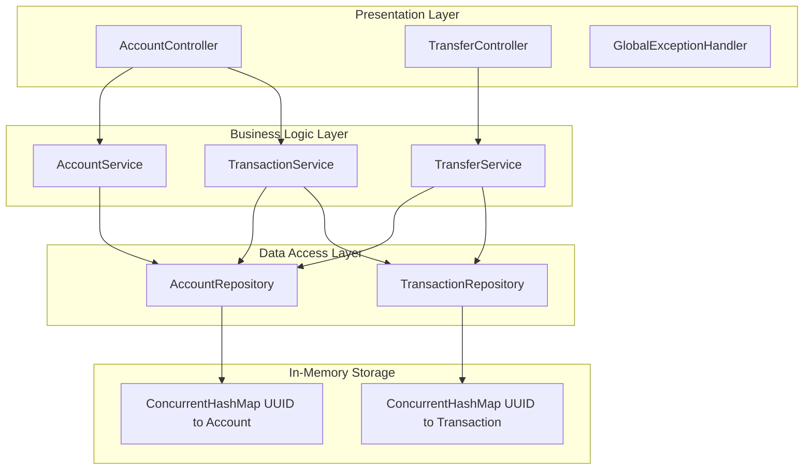
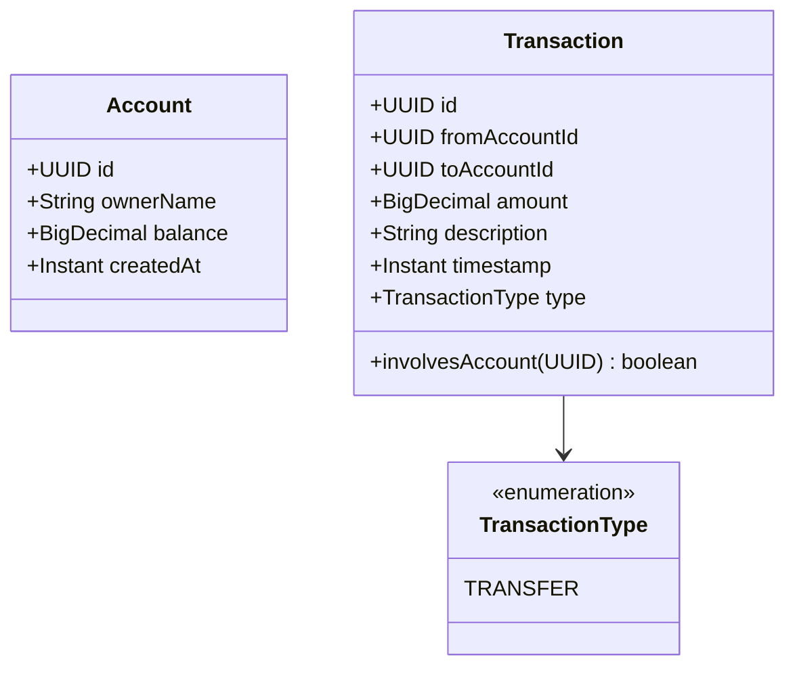
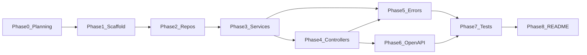

# Banking Transactions API — Master Plan

> **Status:** Phase 0 complete (planning). Implementation begins at Phase 1.
>
> **Stack:** Java 17 · Spring Boot 3.3 · Maven · In-memory storage

---

## Table of Contents

1. [Phase 0 — Planning & Design](#phase-0--planning--design)
2. [Phase 1 — Project Scaffolding](#phase-1--project-scaffolding)
3. [Phase 2 — Domain Model & Repositories](#phase-2--domain-model--repositories)
4. [Phase 3 — Service Layer](#phase-3--service-layer)
5. [Phase 4 — DTOs & REST Controllers](#phase-4--dtos--rest-controllers)
6. [Phase 5 — Error Handling & Logging](#phase-5--error-handling--logging)
7. [Phase 6 — OpenAPI Documentation](#phase-6--openapi-documentation)
8. [Phase 7 — Testing](#phase-7--testing)
9. [Phase 8 — README & GitHub Submission](#phase-8--readme--github-submission)
10. [Dependency Graph](#dependency-graph)
11. [Review Checklist](#review-checklist)

---

## Phase 0 — Planning & Design

**Goal:** Align on requirements, architecture, API contracts, and scope *before* writing implementation code. No feature code in this phase — only decisions and documentation.

**Deliverable:** This `plan.md` file, agreed-upon API design, and a clear phase-by-phase roadmap.

---

### 0.1 Assignment Requirements (What We Must Build)

The take-home asks for a **RESTful Banking Transactions API** in **Java (Spring Boot)**.

#### Required Operations

| # | Operation | HTTP | Endpoint |
|---|-----------|------|----------|
| 1 | Create account with initial balance | `POST` | `/api/v1/accounts` |
| 2 | Transfer funds between accounts | `POST` | `/api/v1/transfers` |
| 3 | Retrieve transaction history for an account | `GET` | `/api/v1/accounts/{accountId}/transactions` |
| 4 | Extras for completeness | — | See [0.5 Scope](#05-scope-moderate-extras) |

#### Non-Functional Requirements (from PDF)

| Requirement | How We Satisfy It |
|-------------|-------------------|
| Three-layer design | Controller → Service → Repository |
| Dependency injection | Spring `@Service`, `@Repository`, constructor injection |
| DTOs between layers | Request/response DTOs; domain entities never exposed at API boundary |
| Input validation | Jakarta Bean Validation (`@Valid`, `@NotBlank`, `@DecimalMin`, etc.) |
| Graceful error handling | Custom exceptions + `@RestControllerAdvice` → consistent JSON errors |
| In-memory storage | `ConcurrentHashMap` repositories (no database) |
| README with build/run | Phase 8 |
| Document assumptions | Phase 8 (README section) |
| GitHub repository | Phase 8 |

---

### 0.2 Technology Decisions

| Decision | Choice | Rationale |
|----------|--------|-----------|
| Language | Java 17 | Assignment specifies Java; LTS version, widely supported |
| Framework | Spring Boot 3.3.x | Assignment suggests Spring Boot; built-in DI, validation, testing |
| Build tool | Maven | User preference |
| API docs | springdoc-openapi 2.6 | Swagger UI for reviewers; minimal config |
| Money type | `BigDecimal` | Avoid floating-point rounding errors |
| Storage | In-memory `ConcurrentHashMap` | Assignment explicitly says no database |
| Auth | None | Out of scope; document as assumption |
| ID type | `UUID` | Safe for concurrent creation, no sequential leaks |

---

### 0.3 Architecture Design



#### Layer Responsibilities

| Layer | Package | Responsibility |
|-------|---------|----------------|
| **Presentation** | `controller`, `exception`, `dto` | HTTP mapping, validation triggers, response shaping, error translation |
| **Business** | `service` | Business rules, orchestration, concurrency control for transfers |
| **Data** | `repository`, `model` | Persistence abstraction, in-memory storage |

#### Concurrency Strategy (Transfers)

Transfers must be **atomic** — debit and credit happen together or not at all.

**Approach:** In `TransferService`, acquire locks on both accounts in a **consistent order** (sorted by UUID) to prevent deadlock, then:

1. Verify sufficient funds
2. Debit source account
3. Credit destination account
4. Persist transaction record

This will be documented as an assumption in the README.

---

### 0.4 API Contract Design

**Base path:** `/api/v1`

#### Endpoints

| Method | Path | Status | Description |
|--------|------|--------|-------------|
| `POST` | `/accounts` | 201 | Create account |
| `GET` | `/accounts/{accountId}` | 200 | Get account details *(extra)* |
| `POST` | `/transfers` | 201 | Transfer funds |
| `GET` | `/accounts/{accountId}/transactions` | 200 | Paginated transaction history *(extra)* |

#### Request Bodies

**Create Account**
```json
{
  "ownerName": "Jane Doe",
  "initialBalance": 1000.00
}
```

**Transfer**
```json
{
  "fromAccountId": "3fa85f64-5717-4562-b3fc-2c963f66afa6",
  "toAccountId": "7c9e6679-7425-40de-944b-e07fc1f90ae7",
  "amount": 50.00,
  "description": "Rent payment"
}
```

#### Response Bodies

**Account**
```json
{
  "id": "3fa85f64-5717-4562-b3fc-2c963f66afa6",
  "ownerName": "Jane Doe",
  "balance": 1000.00,
  "createdAt": "2026-07-29T20:00:00Z"
}
```

**Transfer**
```json
{
  "transactionId": "9b1deb4d-3b7d-4bad-9bdd-2b0d7b3dcb6d",
  "fromAccountId": "3fa85f64-5717-4562-b3fc-2c963f66afa6",
  "toAccountId": "7c9e6679-7425-40de-944b-e07fc1f90ae7",
  "amount": 50.00,
  "timestamp": "2026-07-29T20:05:00Z"
}
```

**Transaction History (paginated)**
```json
{
  "content": [
    {
      "id": "9b1deb4d-3b7d-4bad-9bdd-2b0d7b3dcb6d",
      "fromAccountId": "3fa85f64-5717-4562-b3fc-2c963f66afa6",
      "toAccountId": "7c9e6679-7425-40de-944b-e07fc1f90ae7",
      "amount": 50.00,
      "description": "Rent payment",
      "timestamp": "2026-07-29T20:05:00Z",
      "type": "TRANSFER"
    }
  ],
  "page": 0,
  "size": 20,
  "totalElements": 1,
  "totalPages": 1
}
```

**Error (all failures)**
```json
{
  "timestamp": "2026-07-29T20:05:00Z",
  "status": 404,
  "error": "Not Found",
  "message": "Account not found: 3fa85f64-5717-4562-b3fc-2c963f66afa6",
  "path": "/api/v1/accounts/3fa85f64-5717-4562-b3fc-2c963f66afa6"
}
```

#### HTTP Status Codes

| Scenario | Status |
|----------|--------|
| Success (create) | 201 Created |
| Success (read) | 200 OK |
| Validation failure | 400 Bad Request |
| Account not found | 404 Not Found |
| Insufficient funds | 422 Unprocessable Entity |
| Unexpected server error | 500 Internal Server Error |

---

### 0.5 Scope (Moderate Extras)

User chose **moderate** extras — enough polish to impress reviewers without over-engineering.

#### In Scope (Extras)

| Extra | Phase | Why |
|-------|-------|-----|
| `GET /accounts/{id}` | 4 | Useful for verifying balances after transfers |
| Paginated transaction history | 3, 4 | Scalable history endpoint |
| OpenAPI / Swagger UI | 6 | Easy API exploration for reviewers |
| Structured logging (SLF4J) | 5 | Observability, professional touch |
| Unit + integration tests | 7 | Demonstrates quality and maintainability |

#### Out of Scope

| Item | Reason |
|------|--------|
| Database (PostgreSQL, H2, etc.) | Assignment says in-memory only |
| Authentication / JWT | Not required; adds complexity |
| Docker / CI pipeline | User chose moderate, not full |
| Separate deposit/withdrawal endpoints | Transfer covers the core requirement |
| Email notifications | Not relevant to assignment |

These out-of-scope items can be listed as **future enhancements** in the README.

---

### 0.6 Domain Model



#### Business Rules

| Rule | Enforcement Layer |
|------|-------------------|
| `ownerName` must not be blank | DTO validation + service |
| `initialBalance` must be ≥ 0 | DTO validation |
| `amount` must be > 0 | DTO validation + service |
| Cannot transfer to same account | Service (`InvalidTransferException`) |
| Cannot transfer more than balance | Service (`InsufficientFundsException`) |
| Account must exist before transfer/history | Service (`AccountNotFoundException`) |
| Money rounded to 2 decimal places | Service (`HALF_UP`) |
| History includes sent AND received txs | Repository filter |
| History sorted newest first | Repository sort |

---

### 0.7 Project Structure

```
banking-transactions-api/
├── pom.xml
├── plan.md                          ← this file
├── README.md                        ← Phase 8
├── .gitignore
├── src/main/java/com/brainridge/banking/
│   ├── BankingApplication.java
│   ├── config/
│   │   └── OpenApiConfig.java
│   ├── controller/
│   │   ├── AccountController.java
│   │   └── TransferController.java
│   ├── dto/
│   │   ├── request/
│   │   │   ├── CreateAccountRequest.java
│   │   │   └── TransferRequest.java
│   │   └── response/
│   │       ├── AccountResponse.java
│   │       ├── TransferResponse.java
│   │       ├── TransactionResponse.java
│   │       ├── PageResponse.java
│   │       └── ErrorResponse.java
│   ├── exception/
│   │   ├── AccountNotFoundException.java
│   │   ├── InsufficientFundsException.java
│   │   ├── InvalidTransferException.java
│   │   └── GlobalExceptionHandler.java
│   ├── model/
│   │   ├── Account.java
│   │   ├── Transaction.java
│   │   └── TransactionType.java
│   ├── repository/
│   │   ├── AccountRepository.java
│   │   ├── TransactionRepository.java
│   │   └── impl/
│   │       ├── InMemoryAccountRepository.java
│   │       └── InMemoryTransactionRepository.java
│   └── service/
│       ├── AccountService.java
│       ├── TransferService.java
│       └── TransactionService.java
└── src/test/java/com/brainridge/banking/
    ├── service/
    │   ├── AccountServiceTest.java
    │   ├── TransferServiceTest.java
    │   └── TransactionServiceTest.java
    └── integration/
        └── BankingApiIntegrationTest.java
```

---

### 0.8 Assumptions (To Document in README)

| # | Assumption |
|---|------------|
| 1 | Data is stored in memory and **lost on application restart** |
| 2 | No authentication or authorization is required |
| 3 | All monetary values use `BigDecimal` with **2-decimal precision** (`HALF_UP` rounding) |
| 4 | **No overdraft** — transfers are rejected if the source balance is insufficient |
| 5 | Transfers are **immediately committed** (no pending/failed states) |
| 6 | Concurrent transfers are handled via **ordered account locking** (sorted UUIDs) |
| 7 | Transaction history includes both **sent and received** transfers for the account |
| 8 | Pagination defaults: `page=0`, `size=20`, max `size=100` |
| 9 | Account IDs are UUIDs generated server-side on creation |
| 10 | Only `TRANSFER` transaction type exists (no separate deposit/withdrawal) |

---

### 0.9 Environment Prerequisites

| Tool | Required Version | Notes |
|------|-----------------|-------|
| Java | 17+ | User has Java 25 installed (compatible) |
| Maven | 3.8+ | Must be available on PATH or via Maven Wrapper |
| Git | Any recent | For GitHub submission |
| Browser or curl | — | For manual API testing |

---

### 0.10 Success Criteria

Phase 0 is **complete** when:

- [x] Assignment requirements are mapped to concrete endpoints and layers
- [x] Technology stack is chosen and justified
- [x] API contracts (request/response/error) are defined
- [x] Domain model and business rules are documented
- [x] Scope (in/out) is explicit
- [x] Assumptions are listed
- [x] Phases 1–8 are defined with clear deliverables
- [x] This `plan.md` exists in the project root

Implementation (Phase 1+) does **not** start until you approve this plan.

---

### 0.11 Estimated Timeline

| Phase | Focus | Time |
|-------|-------|------|
| **0** | Planning & design | ✅ Done |
| **1** | Scaffolding | ~30 min |
| **2** | Repositories | ~45 min |
| **3** | Services | ~1–1.5 hrs |
| **4** | Controllers + DTOs | ~1 hr |
| **5** | Error handling + logging | ~45 min |
| **6** | OpenAPI | ~30 min |
| **7** | Tests | ~1.5 hrs |
| **8** | README + GitHub | ~45 min |
| | **Total (Phases 1–8)** | **~6–7 hrs** |

---

## Phase 1 — Project Scaffolding

**Goal:** Runnable Spring Boot skeleton with dependencies and package layout.

**Tasks:**
- Configure `pom.xml` with Spring Web, Validation, springdoc-openapi, spring-boot-starter-test
- Create `BankingApplication.java` entry point
- Add `application.properties` (port 8080, logging pattern, swagger paths)
- Add `.gitignore`
- Verify `mvn spring-boot:run` starts cleanly

**Deliverable:** Empty app boots with no errors.

---

## Phase 2 — Domain Model & Repositories

**Goal:** In-memory persistence with clean repository interfaces.

**Tasks:**
- `Account` and `Transaction` domain entities
- `AccountRepository` / `TransactionRepository` interfaces
- `InMemoryAccountRepository` / `InMemoryTransactionRepository` with `ConcurrentHashMap`
- `findByAccountId` filters and sorts by timestamp descending

**Deliverable:** Repositories injectable and unit-testable.

---

## Phase 3 — Service Layer

**Goal:** All business rules in services; controllers stay thin.

**Tasks:**
- `AccountService` — create, get
- `TransferService` — atomic transfer with locking, fund checks
- `TransactionService` — paginated history

**Deliverable:** Services with full business logic, ready for controllers.

---

## Phase 4 — DTOs & REST Controllers

**Goal:** Expose validated API endpoints.

**Tasks:**
- Request DTOs with Jakarta validation annotations
- Response DTOs with `from()` factory methods
- `AccountController` — POST/GET accounts, GET transactions
- `TransferController` — POST transfers

**Deliverable:** All 4 endpoints callable via curl/Postman.

---

## Phase 5 — Error Handling & Logging

**Goal:** Consistent JSON errors and observable operations.

**Tasks:**
- Custom exceptions (`AccountNotFoundException`, `InsufficientFundsException`, `InvalidTransferException`)
- `GlobalExceptionHandler` with `@RestControllerAdvice`
- `ErrorResponse` DTO
- SLF4J structured logging (INFO/WARN/ERROR)

**Deliverable:** Every error returns JSON, never a raw stack trace.

---

## Phase 6 — OpenAPI Documentation

**Goal:** Interactive API docs for reviewers.

**Tasks:**
- `OpenApiConfig` with title, description, version
- `@Operation` and `@ApiResponse` on all controller endpoints
- Swagger UI at `/swagger-ui.html`

**Deliverable:** Reviewer can explore and test all endpoints in browser.

---

## Phase 7 — Testing

**Goal:** Demonstrate correctness and maintainability.

**Tasks:**
- Unit tests: `AccountServiceTest`, `TransferServiceTest`, `TransactionServiceTest`
- Integration test: full flow (create → transfer → verify → history)
- Error flow tests: missing account, insufficient funds, bad request body

**Deliverable:** `mvn test` passes green.

---

## Phase 8 — README & GitHub Submission

**Goal:** Reviewer can clone, build, run in under 5 minutes.

**Tasks:**
- README with overview, prerequisites, build/run, curl examples, Swagger link, assumptions
- Initialize git repo
- Push to GitHub

**Deliverable:** Submission-ready repository.

---

## Dependency Graph



Phases 5 and 6 can run in parallel after Phase 4.

---

## Review Checklist

Before submission, verify:

- [ ] All 3 required operations work end-to-end
- [ ] Three-layer separation with constructor DI throughout
- [ ] DTOs at API boundary; entities never exposed directly
- [ ] `@Valid` on all request bodies
- [ ] Insufficient funds → 422 JSON error
- [ ] Invalid account ID → 404 JSON error
- [ ] In-memory storage with thread-safe transfers
- [ ] OpenAPI/Swagger accessible at `/swagger-ui.html`
- [ ] `mvn test` passes
- [ ] README has build/run instructions and assumptions
- [ ] Code pushed to GitHub
